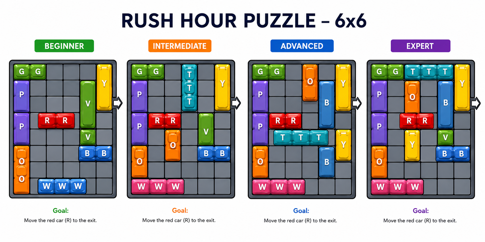
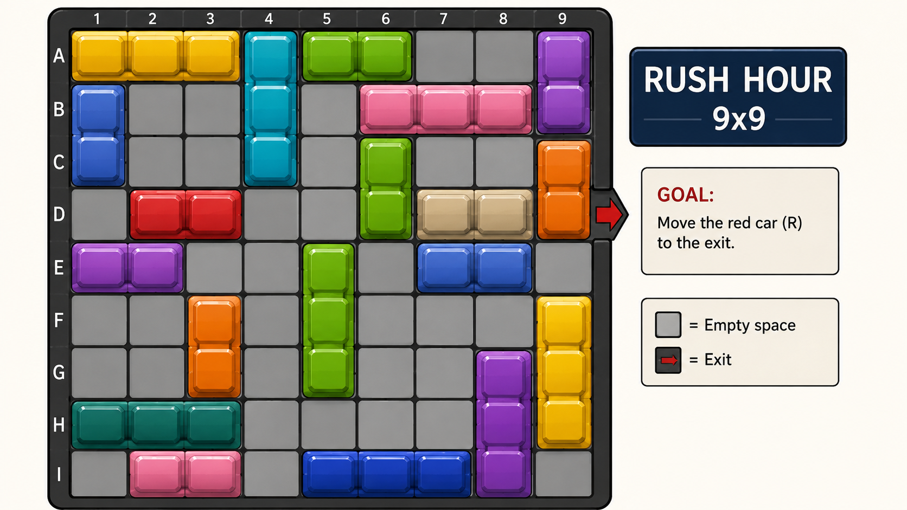
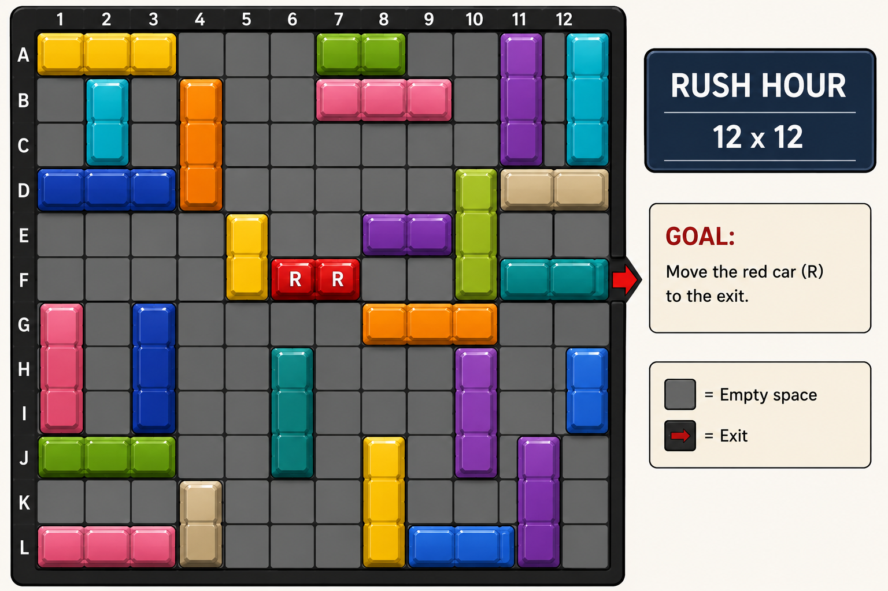

# Rush Hour Puzzle


In the Rush Hour game, the goal is **to remove the red car from the board**, through the only way out.  Therefore, the player needs to move the other vehicles to clear the path.
The game has the following rules:
 
 • 3 boards: 6x6, 9x9 and 12x12;
 
 • 4 levels of difficulty: beginner, intermediate, advanced, expert;
 
 • 16 vehicles: 12 cars and 4 trucks;
 
 • Each car occupies 2 squares and each truck occupies 3 squares;
 
 • Rotation is not allowed, only to move the vehicles vertically and horizontally, as long as there are no obstacles in the way.

<br>

**Features**

 • Simple graphic interface. 
 
 • Possibility to choose the board size. 
 
 • Possibility to choose different levels of difficulty on the same board. 
 
 • Possibility to choose the desired search algorithm.  

<br>

**Rush Hour Puzzle tries to solve boards as fast as possible with three different algorithms:** 

 • Breadth-First Search (BFS) : At each step, BFS expandes the state with the fewest moves from the initial state. It continues this process, exploring all possible moves from each state at the current depth level before moving to deeper levels. Ensure finding the shortest solution path in terms of the number of moves.
 
 • Depth-First Search : In DFS, the algorithm explores as far as possible along each branch before backtracking. It begins by expanding the deepest unexpanded state in the current branch of the search tree, until a solution is found or until it has explored all possible paths. While DFS does not guarantee finding the shortest solution path, it is often used in scenarios where exhaustively searching a large space is more important than finding the shortest path.
 
 • A* Algorithm :  A* evaluates states based on a combination of the cost of reaching the state from the initial state and an estimated cost from the state to the goal. A* intelligently explores states and finds optimal solutions. 

<br>

 **Requisites**
 
 • Python
 
 • Pygame librarie
 
 • Sys
 
 • Copy
 
<br>

 **How to use:**

 • Install the Pygame library, if it is not already installed. 
 
 • Go to the terminal and check that you're in the right directory to gain access.
 
 • Run the command 'python3 start.py' and choose whether you prefer to play the game in Pygame or in the terminal.

 • If you are using Pygame, use the mouse to move the pieces on the board, or if you are using terminal, indicate the car/truck and its moviment.

 • The empty spaces on the board, where you can move the cars/trucks, in pygame are represented by blank spaces and in the terminal are represented by points.

 

<br>

### 6x6: beginner • intermediate • advanced • expert
<p align="left">
  
</p>

### 9x9: game_9x9
<p align="left">
  
</p>

### 12x12: game_12x12
<p align="left">
  
</p>


## Files

**RushHour.py** is the execution file for the interface, where the user can choose the size of the board, the difficulty level and the algorithm.


**RushHourClass.py** is made up of 3 classes: class Vehicle - provides information about the vehicles; class Dimensions- defines the size of the board: class Dimensions - fills in the board, checks the possible moves and checks if the game has been won.


**Algorithms.py** file contains three algorithms for solving the game: a Breadth-First search, a Depth-First search and the A* algorithm.


**start.py** is the file that allows the user to play in the terminal or pygame and also ask for hints to find the best solution according to the selected algorithm.


**game.py** contains various classes that define the game, including the class Game that allows the user to play.

<br>

## Getting Started  
  
Rush Hour Puzzle allows the user to choose the size of the board and the game to be solved. Then the user can decide which algorithm to use. When the game has been solved, the user can see the time it took in seconds, the number of nodes the algorithm made, the number of steps to reach the solution and the moves the cars had to make.

<br>

### Run the program  

To use Rush Hour Solver it is necessary to have python 3 installed. You can run the program by entering python followed by the name of the RushHour document:  
```
$ python RushHour.py
```
When you are prompted to choose the board size, enter for example '1' or '6x6':  

*What board size would you like to solve?*  
 1.6x6  
 2.9x9  
 3.12x12  
 ```
 1
 ```  
When you are prompted to choose the game, type in the filename of the game:  

*These 6x6 boards are available:*

*beginner.csv*  
*intermediate.csv*  
*advanced.csv*  
*expert.csv*  
*Which board would you like to solve?*   
 ```
 advanced.csv
 ```  
When you are prompted to choose the algorithm, enter for example '2':  

*Which algorithm would you like to use?*  
*1. A* Algorithm*    
*2. Breadth First Search*  
*3. Depth First Search*
 ```
 2
 ```  
 This will give the following results:
 ```
found board
Time: 0.28125810623168945
Nodes: 1072
Length solution: 17
['G to the right', 'P up', 'B to the left', 'Y down', 'O up', 'W to the left', 'B to the left', 'Y down', 'W to the left', 'B to the left', 'V down', 'Y down', 'V down', 'R to the right', 'R to the right', 'R to the right']
 ```

<br>
<br>

### Play Rush Hour Puzzle  

To play Rush Hour Puzzle you need python 3 installed. You can run the programme by entering python followed by the name of the start document:
```
$ python start.py
```
When asked to choose where you want to play, enter for example '1':

Welcome to the 'Rush Hour Puzzle' game!
Please chose if you rather play in Pygame or Terminal:
     Pygame (1)
     Terminal (2)
     Quit (3)
     Hint (4)
 ```
 2
 ```  
When you are prompted to choose the game, type in the filename of the game:  

Hello! Welcome to our version of the 'Rush Hour Puzzle' in terminal!
Whenever you want to quit the game, just type 'quit'.
If you want to go back to the menu, type 'menu'.
Or if you simply want to restart the level type 'r'.
Ready to start? (y/n)  
 ```
 y
 ```  
Menu:

  6x6
  
  9x9
  
  12x12

Choose the board size (ex: 6x6):
 ```
 6x6
 ```
BOARD - 6x6
  1 - beginner

  2 - intermediate

  3 - advanced

  4 - expert

Choose the level (example: 1):
```
 1

Beginner:

G G . . . Y

P . . V . Y

P R R V . Y

P . . V . .

O . . . B B

O . W W W .


Enter your move (e.g., 'R D' for moving vehicle R down):
 ```  

<br>

## Future Improvements

Although the current version already provides a fully playable game in both Terminal and Pygame, the project has clear potential for future development.

One of the main planned improvements is the integration of an **AI-assisted solver directly into the Pygame interface** through a dedicated **"Solve with AI"** button.

The proposed functionality would include:

- ✅ **Solve with AI** button integrated into the graphical interface.
- ✅ Selection of the desired search algorithm (**A***, **Breadth-First Search (BFS)** or **Depth-First Search (DFS)**).
- ✅ Automatic computation of the optimal (or selected) solution.
- ✅ Step-by-step animation of the solution, reproducing the exact sequence of moves as if a player were solving the puzzle manually.
- ✅ Possibility of comparing the behaviour and performance of different search algorithms in a visual and interactive way.

This feature would significantly improve the educational value of the project by allowing users not only to solve the puzzle, but also to understand how different Artificial Intelligence search algorithms explore the state space and reach a solution.

<br>

## Authors 

* **Beatriz Pereira** - *Bioinformatics - FCUP* - [Beapereirax](https://github.com/Beapereirax) 
* **Carolina Leite** - *Bioinformatics - FCUP* - [caroleite05](https://github.com/caroleite05)
* **Inês Santos** - *Bioinformatics - FCUP* - [up202305589](https://github.com/up202305589)

<br>

## Link to the course:
This course is part of the **second semester** of the **first year** of the **Bachelor's Degree in Bioinformatics** at **FCUP, ICBAS and FFUP** in the academic year 2023/2024. You can find more information about this course at the following link:

###

[](https://sigarra.up.pt/fcup/pt/ucurr_geral.ficha_uc_view?pv_ocorrencia_id=529873) <br>
[](https://www.up.pt/fcup/pt/)
[](https://www.up.pt/icbas/pt/)
[](https://sigarra.up.pt/ffup/pt/web_page.Inicial)

###


*Elementos de Inteligência Artificial e Ciência de Dados - FCUP - 2023/2024*
